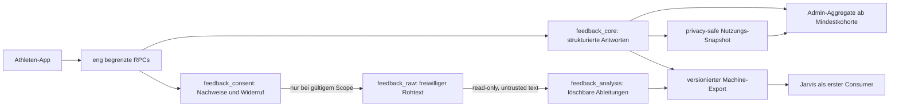

# Feedback Intelligence 1.1 – Implementierungs- und Integrationsplan

Stand: 2026-08-05
Arbeitsbranch: `codex/feedback-intelligence-v1-1-20260805`
Basis: `origin/main` bei `2535ade4ee021dffa19eb5c3bacd4144edeb7430`
Status: lokale Implementierung und isolierter synthetischer Staging-Nachweis grün; keine Production-, KI-, Jarvis- oder App-Store-Aktivierung

## Zielbild

RewirePerform fragt an den deterministischen Programmtagen 10, 24, 39 und 55 kurze, phasengerechte Produktrückmeldungen ab. Jede relevante Frage kombiniert eine strukturierte Antwort mit `+ Kurz etwas dazu sagen`. Strukturierte Antworten funktionieren immer unabhängig vom optionalen Freitext.

Die Daten helfen RewirePerform, Verständlichkeit, Alltagstauglichkeit, Nutzung, Abruf und wahrgenommene Veränderung zu verbessern. Sie dürfen nicht für Werbung, Coach-Bewertung, individualisierte psychologische Profile oder automatische Entscheidungen über Athletinnen und Athleten verwendet werden. Journal- und Reflexionstexte bleiben vollständig außerhalb dieses Systems.

## Verbindliche Produktentscheidungen

- Checkpoints: Tag 10, 24, 39 und 55.
- Kontext wird nach Programmphase, Tag und Inhalt formuliert, nicht nach Identität, Sportart, Position oder persönlichem Profil.
- Vergleichbare Konstrukte erhalten stabile `construct_id`, `item_family_id`, `item_variant_id` und `scale_id`; die sichtbaren Formulierungen dürfen sich phasengerecht unterscheiden.
- Positive und negative Antworten sind gleichwertig; Kritik wird ausdrücklich eingeladen.
- Tag 10 fokussiert Verständnis, Ablauf, Umfang und Alltagseindruck.
- Tag 24 erweitert um beginnenden Transfer, Selbstlernen und wahrgenommene Veränderung.
- Tag 39 fokussiert Anwendung, Abruf und beginnende Automatisierung.
- Tag 55 beginnt ungeprimt mit freiem Abruf und fragt danach Nutzung, Behalten, Transfer und Verbesserungsprioritäten ab.
- Tag 10 zeigt nur ein Danke; ab Tag 24 ist eine neutrale Wiedergabe ausgewählter eigener Antworten erlaubt. Es gibt keine Bewertung und keinen Wirkungsnachweis.
- Alle Fragen und Zusatztexte können übersprungen werden.

## Datenschutz- und Zugriffsarchitektur

Direkte Tabellenrechte sind für `anon`, `authenticated`, Coaches und `service_role` entzogen. Der spätere Machine-Consumer erhält ausschließlich einen neuen, versionsgebundenen Read-only-Vertrag. Rohtext ist `UNTRUSTED_USER_TEXT` und niemals eine Anweisung.

## Umsetzungsblöcke

| Block | Ergebnis | Status |
| --- | --- | --- |
| 0. Source und Gates | sauberer Worktree, aktuelle Main-Basis, Consumer-Draft und Governance geprüft | fertig |
| 1. Inhaltsvertrag | Tag 10/24/39/55, stabile Vergleichsmarker, Consent-Copy und Invarianten | lokal fertig; sichtbare Tageskontexte bytegenau an finalen dreistufigen Produktions-/Rest-Day-Content-Commit `47519c273f30e73781b827645c726be8e9713db4` und vier kanonische Tages-Hashes gebunden; acht progressive Ruhetag-Visualisierungsfragen nutzen konsequent den sichtbaren Produktbegriff `Visualisierung` |
| 2. Synthetischer UX-Flow | Einladung, Intro, Fragen, Multi-/Single-Select, Skip, Consent, Freitext, Abschluss | fertig |
| 3. Private Datenbasis | getrennte Core-, Consent-, Raw- und Analysis-Schemas | fertig |
| 4. Datenbank-Sicherheit | keine direkten Rechte, Consent- und Minor-Gates, Widerruf, Account-Cascade, Negativtests | fertig |
| 5. Transaktionaler Submit | servervalidierte Entwürfe, Idempotenz, Retry, Finalisierung, ungültige Optionen fail-closed | fertig |
| 6. Checkpoint-Integration | kalendertagbasierte Eignung, einmalige Einladung, Wiederaufnahme, Kill-Switch | lokal fertig; Live-Gate, Autosave, Background-Save, Resume und Submit bleiben deaktiviert |
| 7. Deutschland-/Minor-Pfad | DE-only, 15+, spezifischer Guardian-Text-Scope, Staging-Negativtests | fail-closed Matrix, Guardian-Text-Scope sowie fehlender und widerrufener Guardian-Scope in isoliertem Staging technisch verifiziert; Deutschland-Fachfreigabe offen, alle Nicht-DE-Länder ausdrücklich `out_of_scope` |
| 8. Activity-Link | nur Zähl-/Statusdaten; niemals Journalinhalt; pseudonyme Verknüpfung | lokal fertig; per-Programminstanz-Referenz und unveränderlicher Submit-Snapshot gebaut |
| 9. Admin-Auswertung | Aggregate, Mindestkohorte, Testdatentrennung, keine Individualansicht | lokal fertig; kein Production-Read |
| 10. Machine-Export | KI-agnostisch, Jarvis-kompatibel, read-only, Consent bei Export erneut geprüft | lokal fertig und schema-valide; ohne Execute-Grant, Credential, Transport oder Production-Gate |
| 11. Store/Privacy/Retention | Datenschutzerklärung, App-Store-Datenerklärung, Widerrufs-UI, Lösch- und Aufbewahrungsplan | Privacy-/Store-Draft, Widerrufs-UI, technische 365-Tage-Höchstdauer und automatisierter Löschlauf lokal fertig; Rechtsfreigabe der Frist und Zielumgebungsnachweis offen |
| 12. Release-Nachweis | komplette lokale CI, SQL-Negativtests, Native-/Store-Prüfung, Staging-Test | Staging-Build, echte Datenbank-Rollen-/Minor-/Widerrufs-/Tag-10-Prüfungen sowie Guardian-Edge-Auth-/Token-/Origin-Negativtests grün; positiver E-Mail-Zustellpfad, Production-Environment und signierter Native-Nachweis offen |
| 13. 1.1-Integration | Rebase gegen Parallelstand, Konfliktbericht, Review; danach separate Push-/Merge-/Release-Freigaben | Finaler dreistufiger Content-Handoff `47519c2` bestätigt `PROGRAM_DAY_DRAFTS` über `src/content/programV11.ts` als gemeinsame Quelle für Preview und echten `resolveDay`-/`DailyCheckin`-Pfad. Feedback-Pins und Rest-Day-Fragecopy sind lokal darauf synchronisiert; Consumer-Abnahme, Integration in den kombinierten RC, Push/Merge/Release bleiben separat. |

## Bereits implementiert

- Maschinenlesbarer Content-Vertrag mit 55 Fragen und vier draft-only Kampagnen; acht Fragen erfassen die subjektive Nutzung der Ruhetag-Visualisierung.
- Separater Programmtag-Kontextvertrag für Tag 10, 24, 39 und 55 mit finalem
  Content-Commit, SHA-256 pro Tag und direktem Paritätstest gegen Titel,
  Werkzeug, Cue, Mechanismus und Mission des 56-Tage-Programms. Diese Bindung
  verändert weder Messfragen noch die stabile Jarvis-Exportsemantik.
- Tag 55 gibt vor der ersten freien Abrufantwort weder Cue, Missionsstruktur,
  konkrete Handlungsanzahl, gemeinsame Qualität, Musterantwort noch den
  kanonischen Testsatz preis.
- Serverseitige Registry für erlaubte Fragen, Optionen, Mehrfachauswahl, Exklusivoptionen und bedingte Folgefragen.
- Keine pauschalen 0–100-Werte: Skalenrichtung und Auswertungssemantik werden separat versioniert, damit negative und bipolare Skalen nicht falsch normalisiert werden.
- Interne Route `/internal/feedback-intelligence-preview`, nur im vorhandenen Preview-Gate.
- Separate, nicht vorangekreuzte Freitextentscheidung mit gleichwertiger Ablehnungsoption.
- Vier private Supabase-Schemas:
  - `feedback_core`: Kampagnen, pseudonyme Verknüpfung, Submissions, strukturierte Antworten.
  - `feedback_consent`: Athleten- und Guardian-Nachweise sowie Audit.
  - `feedback_raw`: ausschließlich bewusst abgefragte, freiwillige Fragebogenkommentare.
  - `feedback_analysis`: löschbare Analyseartefakte und Machine-Zugriffsaudit.
- Widerruf löscht Rohtext und zuordenbare Artefakte; strukturierte Antworten bleiben erhalten.
- Athleten sehen ihre eigenen minimierten Freitext-Einwilligungsnachweise in `Einstellungen → Konto & Daten` und können jeden Checkpoint einzeln widerrufen. Der Read gibt niemals Rohtext aus.
- Account-Löschung entfernt Submissions, Einwilligungen, Rohtext und Artefakte.
- Unter 16 wird Freitext ohne exakt passenden Guardian-Scope datenbankseitig abgewiesen.
- Eine versionierte Länder-Matrix trennt gesetzliche Altersmetadaten von der konservativen RewirePerform-Regel. Nur DE gehört zum 1.1-Release-Scope und startet für strukturierte Daten und Rohtext mit `legal_review_required`; AT und CH sind ausdrücklich `out_of_scope`.
- Selbst vollständig geöffnete globale Flags können die Ländermatrix nicht umgehen. Nicht-DE-Länder bleiben gesperrt und sind keine Blocker für den Deutschland-Release.
- Alle Kampagnen haben Status `draft`; nichts ist aktiv.
- Ein transaktionaler Athletenvertrag speichert vollständige strukturierte Snapshots, nutzt monotone `client_revision` plus `client_mutation_id`, ignoriert veraltete Offline-Retries und finalisiert atomar/idempotent.
- Checkpoints werden ausschließlich am exakten kalendertagbasierten Programmtag beansprucht; eine Einladung wird je Kampagne und Programminstanz höchstens einmal vergeben, ein begonnener Entwurf kann später wiederaufgenommen werden.
- Globale technische Gates für Athlete Collection, Text Collection, Privacy Notice, App-Store-Deklaration und Minor Policy bleiben alle `false`.
- Der App-Adapter besitzt zusätzlich `VITE_FEEDBACK_INTELLIGENCE_V1_ENABLED`; ohne den exakten Wert `true` führt er keinen Supabase-Aufruf aus.
- Das Dashboard lädt das Live-Gate separat und nur für verifizierte Athleten. Bei geschlossenem Client-Gate erfolgt kein Claim; React-StrictMode-Doppelaufrufe werden pro Session dedupliziert.
- Die Claim-Deduplizierung gilt nur für einen laufenden Request, nicht für den
  gesamten App-Prozess. Nach Dashboard-Remount wird die tagabhängige
  Berechtigung erneut geprüft. Nach einem vorübergehenden Netzwerkfehler erfolgt
  bei Online-, Fokus-, PageShow-, Visibility- oder nativem Active-Ereignis ein
  neuer Versuch; ein Fehler schließt den Flow nicht bis zum App-Neustart.
- Start erzeugt zuerst den exakten versionierten Draft. Änderungen werden verzögert automatisch und beim App-Hintergrund gespeichert; verlorene Antworten werden mit derselben Revision und Mutations-ID wiederholt.
- Ein Server-Draft öffnet direkt auf dem gespeicherten Screen und der gespeicherten Frage. Finaler Submit wartet auf die atomare Serverfinalisierung, bevor die Bestätigung erscheint.
- `subject_reference` ist pro Programminstanz stabil und rotiert bei jedem neuen Programmdurchlauf.
- Beim finalen Submit wird ein unveränderlicher Activity-Snapshot mit ausschließlich kumulativen Counts und groben Status-Buckets erzeugt; `transfer_pulse_count` bleibt bis zu einer separaten Freigabe `null`.
- Ein Admin-only RPC liefert ausschließlich feste Aggregate, trennt Production und vollständig synthetische Daten und unterdrückt alle metrischen Gruppen unter fünf unterschiedlichen Subjects. Aktivitätsassoziationen tragen zwingend `OBSERVATIONAL_NOT_CAUSAL`.
- Der Machine-RPC `read_feedback_intelligence_v0_2_draft` erzeugt ein gegen das byte-gepinnte Jarvis-Schema validiertes Paket, prüft Rohtext-Consent erneut und hasht alle Exportreferenzen. Kein Runtime-Actor besitzt Execute.

## Echte Konflikte und unabhängige Gates

### 1. Deutschland und Minderjährige

Update 1.1 wird ausschließlich für Deutschland vorbereitet. Die technischen Alters-, Guardian- und Widerrufssperren sind versioniert und in isoliertem Staging negativ getestet; die deutsche fachrechtliche Freigabe der Regeln und Texte bleibt offen. Österreich, die Schweiz und alle weiteren Länder gehören nicht zu diesem Release, bleiben technisch fail-closed und lösen erst bei einer späteren internationalen Einführung einen neuen Länder-/Store-/Privacy-Block aus. Details: [`DACH_MINOR_POLICY_DRAFT.md`](./DACH_MINOR_POLICY_DRAFT.md).

### 2. Neuer Freitext-/KI-Zweck

Die bestehende allgemeine Datenbeitragsfreigabe darf nicht still als spezifische Erlaubnis für individuelle freiwillige Feedbacktexte und KI-Analyse umgedeutet werden. Für Unter-16-Jährige bleibt Freitext deshalb gesperrt, bis ein eigener Guardian-Nachweis für Scope, Notice-Version und Notice-Hash existiert. Strukturierte Antworten bleiben davon unabhängig.

### 3. Privacy und App Store

Die lokale Datenschutzerklärung und der App-Store-Draft weisen die eng begrenzte Ausnahme für freiwilliges Produktfeedback nun ausdrücklich aus. Der Schutz von Journal und Reflexion bleibt unverändert. Vor Aktivierung fehlen weiterhin qualifizierte Freigaben, der konkrete Machine-/KI-Empfänger oder ein bestätigter Verzicht darauf sowie eine feste maximale Rohtext-Aufbewahrungsdauer mit automatisiertem Löschlauf. Details: [`APP_STORE_PRIVACY_DRAFT.md`](./APP_STORE_PRIVACY_DRAFT.md). Eine lokale grüne Implementierung ist kein Store- oder Rechtsnachweis.

### 4. Activity-Korrelation und Consumer-Vertrag

Die Datenbank besitzt eine private `subject_reference`, damit strukturierte Antworten später mit erlaubten Aktivitätszählungen derselben Person verbunden werden können. Der aktuelle Jarvis-Consumer-Draft `0.1.0-draft` kennt dieses Feld und einen Activity-Snapshot noch nicht. Der Producer darf diese Felder nicht still ergänzen oder umbenennen. Dafür ist eine explizite, versionierte Contract-Erweiterung mit erneutem Consumer-Review nötig.

Der lokale v0.2-RPC ist nun auf das Consumer-Schema gepinnt. Zwei ausdrücklich dokumentierte Deltas bleiben: SemVer-Build-Metadaten werden wegen des Consumer-`safeId` als `_build_` codiert; der eigenständige Abschlusskommentar kann bis zu einem typisierten `comment_only`-Schema nicht exportiert werden. Siehe [`MACHINE_EXPORT_V0_2_DRAFT.md`](./MACHINE_EXPORT_V0_2_DRAFT.md).

### 5. Jarvis und andere KI-Systeme

Jarvis bleibt erster geplanter Consumer, aber nicht Eigentümer des Datenmodells. Der Producer-Vertrag ist KI-agnostisch. Vor einem echten Read fehlen weiterhin: byte-exaktes Producer-Paket, Privacy-/Minor-/Store-Freigaben, separates Machine-Credential, Rollen-Negativtests und ein ausdrücklich genehmigter synthetischer Read.

## Geplanter Producer-Export

Der bestehende Jarvis-Draft erwartet pro Antwort:

- `feedback_reference`
- `campaign_reference`
- `questionnaire_version`
- `language`
- `product_version`
- `content_version`
- `program_day`
- `question_id`
- `structured_answer`
- optional `comment`
- `consent.state`
- `consent.scope`
- `consent.consent_version`
- `consent.notice_hash`
- `consent.consent_reference`
- `consent.granted_at`
- `consent.withdrawn_at`
- `consent.valid_at_export`

`comment` wird nur ausgegeben, wenn Zustimmung und gegebenenfalls Guardian-Scope sowohl beim Submit als auch beim Export gültig sind. Namen, E-Mail, `user_id`, `team_id`, Coachdaten und Journalinhalte werden nie exportiert. Feldabweichungen blockieren den Consumer, statt still umbenannt zu werden.

## Activity-Snapshot: erlaubte und verbotene Quellen

Erlaubt sind ausschließlich minimierte Nutzungszahlen und Statussignale, zum Beispiel:

- verfügbare und abgeschlossene Programmtage,
- Anzahl abgeschlossener Check-ins,
- Anzahl angelegter Journaleinträge, ohne Länge oder Inhalt,
- Anzahl abgeschlossener Aufgaben,
- Anzahl durchgeführter Transfer-Pulse,
- Wiederaufnahme-/Abbruchstatus und Zeitfenster in groben Buckets.

Verboten sind:

- Journal-, Reflexions- oder Supporttexte,
- Textlänge oder sprachliche Qualitätsbewertung privater Journale,
- individuelle Coach-Beobachtungen oder Coach-Scores,
- Namen, E-Mail, Teamidentität oder direkt exportierbare User-IDs,
- kausale Aussagen wie „mehr Journal verursacht bessere Wirkung“.

Korrelationen bleiben beobachtend: zum Beispiel „In dieser Stichprobe berichten aktivere Nutzer häufiger X“. Sie beweisen keine Wirksamkeit oder Ursache.

## Supabase-Projekt und Plan

Für die lokale Implementierung, PGlite-Negativtests und den aktuellen isolierten Staging-Nachweis ist Supabase Pro nicht erforderlich. Das freigegebene Projekt `zbeswjipayspgvcipzmx` läuft getrennt von Production im Free-Plan und wurde von Supabase bei Erstellung mit 0 USD pro Monat ausgewiesen. Preview Branches, Production-Backup-/Recovery-Anforderungen, Aufbewahrung, Monitoring und ein möglicher Plan-Upgrade werden separat entschieden. Ein Upgrade allein aktiviert oder validiert dieses System nicht.

## Definition of Done für Update 1.1

Das System ist erst 1.1-release-ready, wenn alle folgenden Punkte gleichzeitig erfüllt sind:

1. Alle vier Fragebögen und Versionen sind produktseitig abgenommen.
2. Save/Resume/Retry/Submit funktionieren idempotent und offline-tolerant.
3. Direkte Rollen- und Tabellenzugriffe schlagen in Negativtests fehl.
4. Freitext ohne gültigen Consent oder Guardian-Scope wird technisch unmöglich.
5. Widerruf und Account-Löschung entfernen Rohtext und personenbeziehbare Ableitungen nachweisbar.
6. Checkpoint-Eignung basiert auf dem echten Programmkalender und zeigt jeden Checkpoint höchstens einmal.
7. Activity-Snapshots enthalten nur freigegebene Zähl-/Statusdaten.
8. Admin-Auswertungen unterdrücken kleine Kohorten und enthalten keine Individualansicht.
9. Der Machine-Export erfüllt den gepinnten Consumer-Vertrag bytegenau und fail-closed.
10. Deutschland- und Minor-Gates sind rechtlich entschieden und in Staging verifiziert; alle Nicht-DE-Länder bleiben ausdrücklich `out_of_scope` und technisch gesperrt.
11. Privacy- und App-Store-Erklärungen sind freigegeben und stimmen mit der tatsächlichen Implementierung überein.
12. Vollständige lokale CI, SQL-Tests, Build, native Checks und ein genehmigter synthetischer Staging-Read sind grün.
13. Paralleländerungen sind neu abgeglichen; Push, Merge, Deployment, TestFlight und App-Store-Einreichung wurden jeweils separat freigegeben.

## Aktueller Nachweis

- Kombinierte Staging-CI nach Integration des Golden-Days-Parallelstands: 102 Testdateien und 585 Tests grün.
- TypeScript-Typecheck und Production-Web-Build: grün.
- Sämtliche SQL-Harnesses einschließlich Rollen, Consent, Guardian, Widerruf, Retention, Account-Cascade, DE-only-Ländersperre, idempotentem Submit, Admin-Mindestkohorte und schema-validem synthetischem Machine-Export: grün.
- Statische App-Store-Prüfung und `PrivacyInfo.xcprivacy`-Syntax: grün.
- ESLint: null Fehler; 16 bereits vorhandene Warnungen in von diesem Integrationsblock nicht veränderten Dateien.
- Isolierter Staging-Datenbanknachweis: 90 Migrationen, Rollen-Negativtests, Unter-16-Guardian-Sperre, Widerrufslöschung und Tag-10-RPC-Pfad grün; danach null synthetische Nutzer- oder Feedbackdaten und alle Gates geschlossen.
- Beide Guardian-Edge-Funktionen sind ausschließlich im getrennten Staging aktiv; fehlende Authentifizierung, unbekannte Tokens und fremde Origins scheitern fail-closed. Kein Provider-Secret und keine echte E-Mail wurden verwendet.
- Der echte Production-Environment- und Embedded-iOS-Nachweis bleibt fail-closed, weil dieser Worktree bewusst keine Production-Werte oder Secrets enthält.

Vollständiger lokaler Nachweis: [`RELEASE_EVIDENCE_V1_1_LOCAL_2026-08-05.md`](./RELEASE_EVIDENCE_V1_1_LOCAL_2026-08-05.md).
Vollständiger Staging-Nachweis: [`STAGING_VERIFICATION_2026-08-06.md`](./STAGING_VERIFICATION_2026-08-06.md).

Diese Nachweise belegen lokale technische Eigenschaften. Sie belegen keine Production-Aktivierung, rechtliche Freigabe, App-Store-Akzeptanz, Programmwirksamkeit oder kausale Effekte.
